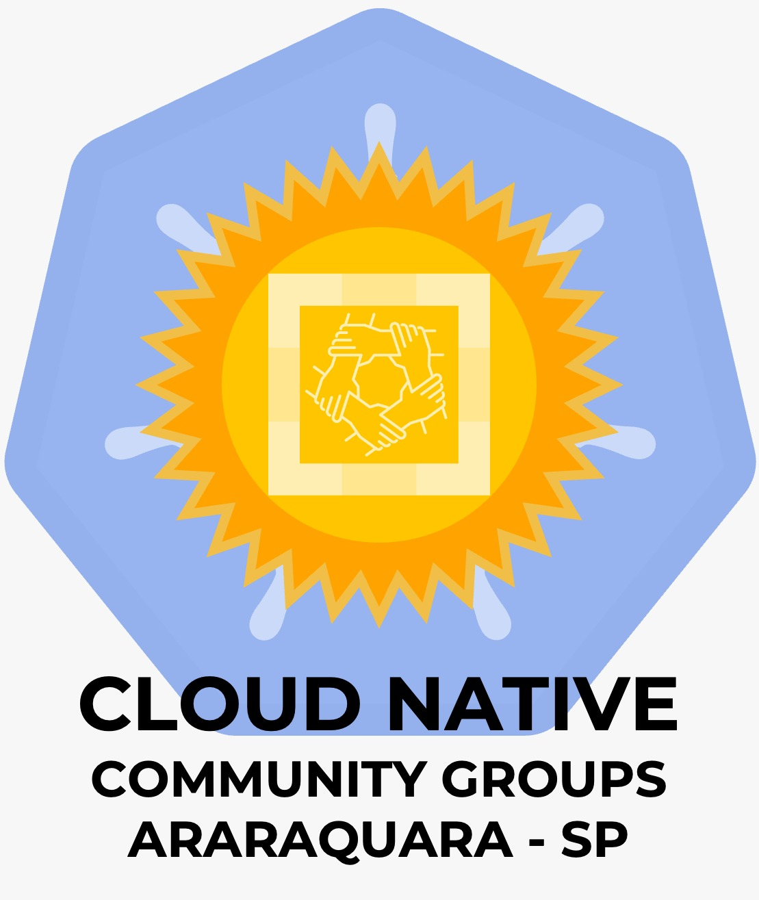

# Talos Linux: um OS minimalista e sem SSH para o Kubernetes

Slides da palestra apresentada no **CNCF Araraquara + FLISOL**.

🔗 [Página do evento](https://community.cncf.io/events/details/cncf-cloud-native-araraquara-presents-cloud-native-araraquara-flisol-meetup-09-presencial/)

---




## Whoami

**Emerson Silva**

- Engenheiro DevOps/SRE na **4Linux**
- +9 anos em ambientes DevOps críticos
- Foco em **Kubernetes**, IaC e confiabilidade
- Escritor, instrutor e palestrante ativo na comunidade
- Autor: *Kubernetes para Iniciantes* e *Mentes Automatizadas*
- Blog: [emerson-silva.blog.br](https://emerson-silva.blog.br)

---

## O que será visto na palestra

1. **O problema com o OS tradicional** — configuration drift, SSH como superfície de ataque e a fragilidade dos scripts de cloud-init
2. **O que é o Talos Linux** — filosofia, design e os quatro pilares: API managed, imutável, minimal e secure by default
3. **Arquitetura e filosofia** — `machined` como PID 1, sistema de arquivos em camadas (SquashFS + overlayfs), partições e configuração declarativa via MachineConfig
4. **Segurança e atualizações** — mTLS obrigatório, RBAC por certificado, atualizações atômicas com esquema de boot A/B e rollback automático
5. **Armazenamento no Talos** — opções CSI (Longhorn, Rook+Ceph, OpenEBS Mayastor), armazenamento em nuvem e bare metal, dimensionamento do control plane
6. **Demo ao vivo** — criando um cluster com `talosctl cluster create`, gerenciando sem SSH via API gRPC
7. **Quando faz sentido usar** — casos de uso ideais e limitações honestas

---

## Como usar os slides

### Pré-requisito

```bash
npm install -g @marp-team/marp-cli
```

### Visualizar no browser com live reload

```bash
marp --watch talos-linux-cncf-flisol.md
```

### Abrir o HTML já gerado

```bash
xdg-open talos-linux-cncf-flisol.html
```

### Exportar para PDF

```bash
marp talos-linux-cncf-flisol.md --pdf --allow-local-files -o talos-linux-cncf-flisol.pdf
```

> `--allow-local-files` é necessário para carregar imagens e logos locais.

### Exportar para HTML

```bash
marp talos-linux-cncf-flisol.md --html --allow-local-files -o talos-linux-cncf-flisol.html
```

---

## Recursos

- Documentação oficial: [docs.siderolabs.com](https://docs.siderolabs.com)
- Repositório Talos: [github.com/siderolabs/talos](https://github.com/siderolabs/talos)
- Blog do autor: [emerson-silva.blog.br](https://emerson-silva.blog.br)
